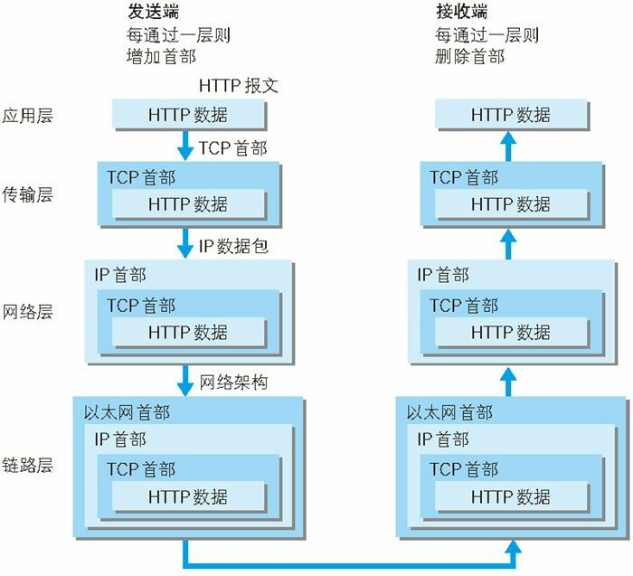
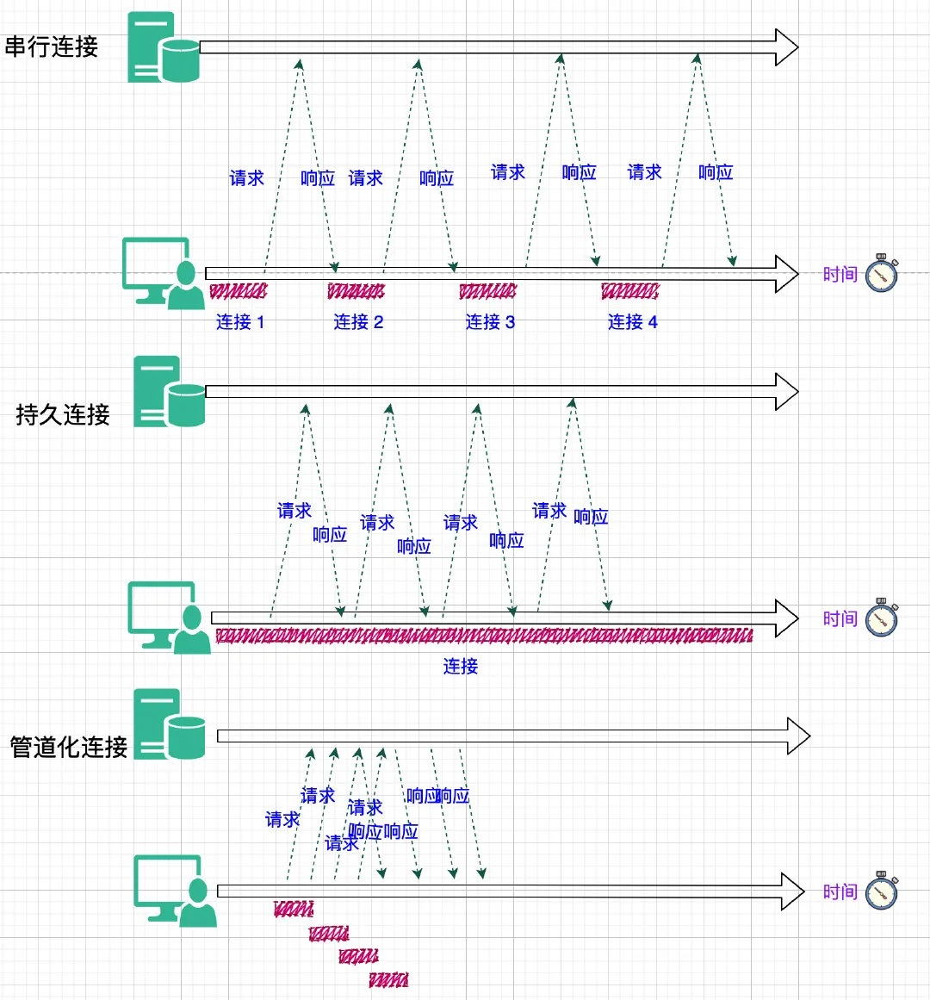

### http协议
##### 1.http协议简介
&emsp;Web使用一种名为HTTP（HyperText Transfer Protocol，超文本传输协议）的协议作为规范，完成从客户端到服务器等一系列运作流程。而协议是指规则的约定。可以说，Web是建立在HTTP协议上通信的。

（通俗来讲就是在Web应用中，<b>服务器把网页传给浏览器，实际上就是把网页的HTML代码发送给浏览器，让浏览器显示出来</b>。而<b>浏览器和服务器</b>之间的<b>传输协议</b>是<b>HTTP</b>）

&emsp;HTTP是<b>不保存状态</b>的协议，既无状态协议，协议本身对于请求或响应之间的通信状态不进行保存，因此连接双方不能知晓对方当前的身份和状态。

&emsp;<b>Cookie</b>技术产生的<b>重要原因</b>之一：<b>客户端的状态管理</b>。

&emsp;浏览器会根据从服务器端发送的响应报文内 Set-Cookie 首部字段信息自动保持 Cookie。而每次客户端发送 HTTP 请求，都会在请求报文中携带 Cookie，作为服务端识别客户端身份状态的标识。

##### 2.TCP/IP 协议族
&emsp;TCP/IP 协议族是<b>Internet最基本的协议</b>，HTTP协议是它的一个<b>子集</b>。层次分为以下四层:
-   <b>应用层</b>
预存了各类通用的<b>应用服务协议</b>，比如，FTP（File Transfer Protocol，文件传输协议）、DNS（Domain Name System，域名系统）以及HTTP协议。

&emsp;DNS域名系统提供<b>域名</b>（如：www.baidu.com）到<b>IP地址</b>（如：119.75.217.109）之间的解析服务

-   <b>传输层</b>
传输层对接上层应用层，提供处于网络连接中两台计算机之间的数据传输所使用的协议。
在传输层有两个性质不同的协议：TCP（Transmission Control Protocol，传输控制协议）和UDP（User Data Protocol，用户数据报协议）。

&emsp;TCP协议是全双工的，即<b>发送数据</b>和<b>接收数据</b>是<b>同步</b>进行的，就好像我们打电话一样，说话的同时也能听见。TCP协议在建立和断开连接时有三次握手和四次挥手，因此在传输的过程中更稳定可靠但同时就没UDP那么高效了。

&emsp;UDP协议是<b>面向无连接</b>的，也就是说在正式传递数据之前不需要先建立连接。UDP 协议不保证有序且不丢失的传递到对端，也就是说不够稳定，但也正因如此，UDP协议比TCP更加高效和轻便。

-   <b>网络层</b>
&emsp;网络层规定了数据通过怎样的传输路线到达对方计算机传送给对方（IP协议等）。

&emsp;与对方计算机之间通过多台计算机或网络设备进行传输时，网络层所起的<b>作用</b>就是在众多的选项内<b>选择一条传输路线</b>。就跟携程提供的回家路线图作用一样。

-   <b>链路层</b>
&emsp;用来处理连接网络的硬件部分，包括控制操作系统、硬件的设备驱动、NIC（Network Interface Card，网络适配器，即网卡），及光纤等物理可见部分（还包括连接器等一切传输媒介）。硬件上的范畴均在链路层的作用范围之内。

##### 3.串行连接、持久连接、管道化持久连接、http/2.0多路复用简介
-   <b>串行连接</b>： HTTP有<b>无连接</b>的特性，即<b>每次连接只能处理一个请求，收到响应后立即断开连接</b>。
&emsp;HTTP/1.0 版本（称为串行连接或短连接、短轮询）中每次HTTP通信后都要断开TCP连接，所以每个新的HTTP请求都需要建立一个新的连接。但在现在网站动则几十条HTTP请求的情况下，很容易达到浏览器请求上限，并且每次请求都建立新的tcp连接（每次都有三次握手四次挥别）极大的增加了通信开销。

-   <b>持久连接</b>： 为解决这个问题，有人提出了持久连接（也叫长连接、长轮询）。一定时间内，同一域名下的HTTP请求，<b>只要两端都没有提出断开连接，则持久保持TCP连接状态，其他请求可以复用这个连接通道</b>。
&emsp;HTTP/1.1 实现并默认了所有连接都是持久连接，这样客户端发起多个HTTP请求时就减少了TCP握手造成的网络资源和通信时间的浪费。但是<b>持久连接采用阻塞模式</b>，下次请求必须等到上次响应返回后才能发起，如果上次的请求还没返回响应内容，下次请求就只能等着（就是常说的线头阻塞）。

-   <b>管道化持久连接</b>： 管道化则可以不用等待响应返回而发送下个请求并按顺序返回响应，现代浏览器并未默认开启管道化。（这方面收集到的资料有限不多说了）

-   <b>HTTP/2.0多路复用</b>： 每个HTTP请求都有一个序列标识符，这样浏览器可以并发多个请求，服务器接收到数据后，再根据序列标识符重新排序成不同的请求报文，而不会导致数据错乱（ 细节参照此文）。同样，服务端也可以并发返回多个响应给浏览器，浏览器收到后根据序列标识重新排序并归入各自的请求的响应报文。并且同一个域名下的所有请求都复用同一个TCP连接，极大增加了服务器处理并发的上限。

-   <b>WebSocket</b>： WebSocket是HTML5提出的一种客户端和服务端通讯的全双工协议，由客户端发起请求，建立连接之后不仅客户端可以主动向服务端发送请求，服务端可以主动向客户端推送信息。 

如图中<b>串行连接</b>：串行连接每次发起请求都必须建立新的tcp连接。
如图中<b>持久连接</b>：持久连接多个http请求可以复用同一个tcp连接，但是下次请求必须在上次响应返回之后进行。
如图中<b>管道化连接</b>：管道化持久连接也可以复用同一个tcp连接，并且可以不用等待发出多个http请求，但是响应必须按顺序返回。

##### 4.HTTP报文
&emsp; 用于HTTP协议交互的信息被称为HTTP报文。客户端的HTTP报文叫请求报文，服务端的HTTP报文叫响应报文。

<b>请求报文</b> 是由请求行（请求方法、协议版本）、请求首部（请求URI、客户端信息等）和内容实体（用户信息和资源信息等，可为空）构成。

<b>响应报文</b>. 是由状态行（协议版本、状态码）、响应首部（服务器名称、资源标识等）和内容实体（服务端返回的资源信息）构成。

##### <b>请求方法</b>
-   GET：get方法一般用于获取服务器资源
-   POST：post方法一般用于传输实体主体
-   PUT：put方法一般用于传输文件
-   DELETE：delete方法用于删除文件
-   HEAD：head方法用于获取报文首部，不返回报文主体
-   OPTIONS：options方法用于询问请求URI资源支持的方法

##### 5.状态码

	<table>
		<tr bgcolor="#eee">
			<th>2XX</th>
			<th>成功（这系列表明请求被正常处理了）</th>
		</tr>
		<tr>
			<td>200</td>
			<td>OK，表示从客户端发来的请求在服务器端被正确处理</td>
		</tr>
		<tr>
			<td>204</td>
			<td>No content，表示请求成功，但响应报文不含实体的主体部分</td>
		</tr>
		<tr>
			<td>206</td>
			<td>Partial Content，进行范围请求成功</td>
		</tr>
	</table>
	<table>
		<tr bgcolor="#eee">
			<th>3XX</th>
			<th>重定向（表明浏览器要执行特殊处理）</th>
		</tr>
		<tr>
			<td>301</td>
			<td>moved permanently，永久性重定向，表示资源已被分配了新的 URL</td>
		</tr>
		<tr>
			<td>302</td>
			<td>found，临时性重定向，表示资源临时被分配了新的 URL</td>
		</tr>
		<tr>
			<td>303</td>
			<td>see other，表示资源存在着另一个 URL，应使用 GET 方法获取资源（对于301/302/303响应，几乎所有浏览器都会删除报文主体并自动用GET重新请求）</td>
		</tr>
		<tr>
			<td>304</td>
			<td>not modified，表示服务器允许访问资源，但请求未满足条件的情况（与重定向无关）</td>
		</tr>
		<tr>
			<td>307</td>
			<td>temporary redirect，临时重定向，和302含义类似，但是期望客户端保持请求方法不变向新的地址发出请求</td>
		</tr>
	</table>
	<table>
		<tr bgcolor="#eee">
			<th>4XX</th>
			<th>客户端错误</th>
		</tr>
		<tr>
			<td>400</td>
			<td>bad request，请求报文存在语法错误</td>
		</tr>
		<tr>
			<td>401</td>
			<td>unauthorized，表示发送的请求需要有通过 HTTP 认证的认证信息</td>
		</tr>
		<tr>
			<td>403</td>
			<td>forbidden，表示对请求资源的访问被服务器拒绝，可在实体主体部分返回原因描述</td>
		</tr>
		<tr>
			<td>404</td>
			<td>not found，表示在服务器上没有找到请求的资源</td>
		</tr>
	</table>
	<table>
		<tr bgcolor="#eee">
			<th>5XX</th>
			<th>服务器错误</th>
		</tr>
		<tr>
			<td>500</td>
			<td>internal sever error，表示服务器端在执行请求时发生了错误</td>
		</tr>
		<tr>
			<td>501</td>
			<td>Not Implemented，表示服务器不支持当前请求所需要的某个功能</td>
		</tr>
		<tr>
			<td>503</td>
			<td>service unavailable，表明服务器暂时处于超负载或正在停机维护，无法处理请求</td>
		</tr>
	</table>
	<table>
		<tr bgcolor="#eee">
			<th>2XX</th>
			<th>成功（这系列表明请求被正常处理了）</th>
		</tr>
		<tr>
			<td>200</td>
			<td>OK，表示从客户端发来的请求在服务器端被正确处理</td>
		</tr>
		<tr>
			<td>204</td>
			<td>No content，表示请求成功，但响应报文不含实体的主体部分</td>
		</tr>
		<tr>
			<td>206</td>
			<td>Partial Content，进行范围请求成功</td>
		</tr>
			<tr>
			<td>302</td>
			<td>found，临时性重定向，表示资源临时被分配了新的 URL</td>
		</tr>
				<tr>
			<td>302</td>
			<td>found，临时性重定向，表示资源临时被分配了新的 URL</td>
		</tr>
		<tr>
			<td>302</td>
			<td>found，临时性重定向，表示资源临时被分配了新的 URL</td>
		</tr>
		<tr>
			<td>302</td>
			<td>found，临时性重定向，表示资源临时被分配了新的 URL</td>
		</tr>
		<tr>
			<td>302</td>
			<td>found，临时性重定向，表示资源临时被分配了新的 URL</td>
		</tr>
	</table>
</cneter>
